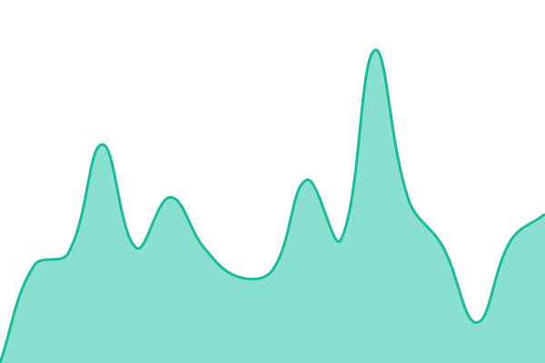
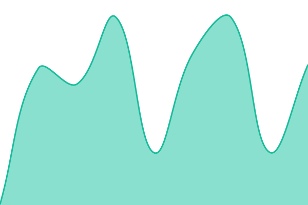
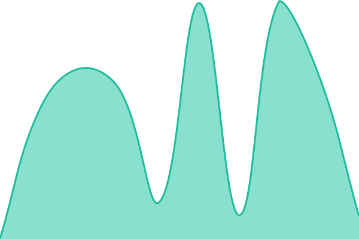

# [📈 Live Status](https://status.astron.live): <!--live status--> **🟩 All systems operational**

This repository contains the open-source uptime monitor and status page for [astron](https://status.astron.live), powered by [Upptime](https://github.com/upptime/upptime).

With [Upptime](https://upptime.js.org), you can get your own unlimited and free uptime monitor and status page, powered entirely by a GitHub repository. We use [Issues](https://github.com/teasyastron/status-page/issues) as incident reports, [Actions](https://github.com/teasyastron/status-page/actions) as uptime monitors, and [Pages](https://status.astron.live) for the status page.

<!--start: status pages-->
<!-- This summary is generated by Upptime (https://github.com/upptime/upptime) -->
<!-- Do not edit this manually, your changes will be overwritten -->
<!-- prettier-ignore -->
| URL | Status | History | Response Time | Uptime |
| --- | ------ | ------- | ------------- | ------ |
|  [Astron](https://astron.live) | 🟩 Up | [astron.yml](https://github.com/teasyastron/status-page/commits/HEAD/history/astron.yml) | 

 573ms
     
 | 

<a href="https://status.astron.live/history/astron">100.00%</a>
    

|  [Rubber](https://rubber.astron.live) | 🟩 Up | [rubber.yml](https://github.com/teasyastron/status-page/commits/HEAD/history/rubber.yml) | 

 260ms
     
 | 

<a href="https://status.astron.live/history/rubber">100.00%</a>
    

|  [DNF](https://dnf.astron.live) | 🟩 Up | [dnf.yml](https://github.com/teasyastron/status-page/commits/HEAD/history/dnf.yml) | 

 222ms
     
 | 

<a href="https://status.astron.live/history/dnf">100.00%</a>
    

|  [CDN](https://cdn.astron.live) | 🟩 Up | [cdn.yml](https://github.com/teasyastron/status-page/commits/HEAD/history/cdn.yml) | 

 897ms
     
 | 

<a href="https://status.astron.live/history/cdn">100.00%</a>
    

<!--end: status pages-->

[**Visit our status website →**](https://status.astron.live)

## 📄 License

- Powered by: [Upptime](https://github.com/upptime/upptime)
- Code: [MIT](./LICENSE) © [Anand Chowdhary](https://anandchowdhary.com)
- Data in the `./history` directory: [Open Database License](https://opendatacommons.org/licenses/odbl/1-0/)
